# Introduction

## Image Augmentation:

Image augmentation is a critical concept in computer vision and machine learning, designed to enhance the diversity and richness of a dataset by applying various transformations to existing images. These transformations aim to simulate real-world scenarios, improve model generalization, and mitigate overfitting. In the context of the provided C++ program, image augmentation plays a significant role in preparing a more robust and varied dataset for image processing tasks.

### Key Concepts in Image Augmentation:

#### 1. **Variability Introductions:**
   - Image augmentation introduces variability to the dataset by applying diverse transformations. This helps the model generalize well to different scenarios and variations it might encounter during training or testing.

#### 2. **Data Augmentation Techniques:**
   - **Zooming and Cropping:** The program employs zooming and cropping techniques using the `Rectangle` class. These operations simulate variations in image scales and perspectives, contributing to a more comprehensive dataset.

   - **Color Shifting:** Shifting colors through adjustments in hue, saturation, and value enhances the dataset's color diversity, making the model more robust to variations in lighting conditions.

   - **Rotation and Flipping:** Rotating and flipping images simulate different orientations and viewpoints, aiding the model in learning features invariant to rotation and mirroring.

   - **Histogram Equalization:** Equalizing the histogram enhances contrast, making the model less sensitive to variations in brightness levels across different images.

   - **Gaussian Noise Addition:** Introducing Gaussian noise simulates imperfections in real-world data, making the model more resilient to noisy input.

#### 3. **Purpose of Image Augmentation:**
   - **Mitigating Overfitting:** Augmenting the dataset with diverse images helps prevent overfitting. A model trained on a more varied dataset is less likely to memorize specific examples and generalize better to unseen data.

   - **Enhancing Model Robustness:** By exposing the model to a wide range of variations, image augmentation helps improve the model's ability to handle diverse inputs, contributing to its overall robustness.

   - **Simulation of Real-World Scenarios:** Augmented datasets better represent the variability present in real-world scenarios, preparing the model for a more realistic deployment.

## Machine Learning Concepts

Machine learning (ML) concepts are integral to understanding the impact of image augmentation on model training and evaluation. The provided C++ program incorporates several ML terms to enhance the image processing tasks and evaluate the effectiveness of image augmentation. Here's a brief overview of relevant ML concepts:

### 1. **Epoch:**
   - An epoch refers to a complete pass through the entire training dataset during model training. In the context of the program, the concept of an epoch becomes relevant when applying image augmentation to multiple images in the dataset over a specified number of iterations.

### 2. **Confusion Matrix:**
   - A confusion matrix is a tabular representation that summarizes the performance of a classification model. It compares the predicted labels with the true labels, providing insights into the model's accuracy, precision, recall, and other metrics. When evaluating the impact of image augmentation, examining the confusion matrix helps analyze the model's ability to correctly classify different classes.

### 3. **Model Evaluation Metrics:**
   - Various metrics, such as accuracy, precision, recall, and F1 score, are commonly used to assess the performance of a machine learning model. These metrics become crucial when comparing the effectiveness of image augmentation techniques. The program may involve the calculation and visualization of these metrics to demonstrate the improvements brought about by augmented datasets.

### 4. **Training and Validation Sets:**
   - The concepts of training and validation sets play a crucial role in model training and evaluation. Image augmentation impacts both sets, influencing the model's ability to generalize to new, unseen data. The program may incorporate the division of datasets into training and validation sets to showcase the benefits of image augmentation during both training and evaluation phases.

### 5. **Overfitting and Generalization:**
   - Overfitting occurs when a model performs well on the training set but fails to generalize to new data. Image augmentation is a strategy to mitigate overfitting by introducing variability to the dataset. The program may include discussions or visualizations highlighting the impact of image augmentation in reducing overfitting and improving model generalization.

### 6. **Learning Rate:**
   - The learning rate is a hyperparameter that determines the step size during model training. Adjusting the learning rate can influence how quickly or slowly a model learns. In the context of image augmentation, the program may experiment with different learning rates to observe their impact on convergence and model performance.


## C++ Concepts Used


1. **Object-Oriented Programming (OOP):**
   - **Classes:** The program employs classes (`fileHandle`, `Rectangle`, `BasicCV`) to encapsulate data and behavior, promoting code organization and encapsulation. This adheres to OOP principles, enhancing modularity and maintainability.

2. **Dynamic Memory Allocation:**
   - **Dynamic Arrays:** The `int* dimensions = new int[2];` statement showcases dynamic memory allocation for an integer array. This allows for flexible storage based on runtime requirements.

3. **File Handling:**
   - **Windows API:** The program interacts with the Windows API for file handling. Functions like `SHBrowseForFolderA` and `FindFirstFileA` enable browsing and traversing directories, showcasing platform-specific functionality.

4. **User Input and Control Flow:**
   - **Console Input:** User input is obtained through `_getch()` from the `<conio.h>` header, providing a way to interact with the program without requiring the Enter key.
   - **Control Flow:** The program utilizes `while` loops and `switch` statements to control the flow of the program based on user input, creating an interactive menu system.

5. **Multithreading:**
   - **Parallel Processing:** The `<thread>` library is utilized to implement multithreading. This allows concurrent execution of image processing tasks, enhancing performance by leveraging multiple CPU cores.

6. **String Manipulation:**
   - **String Operations:** The `std::string` class is used for string manipulation, demonstrating operations such as concatenation (`+`), substring extraction, and comparison. This is crucial for working with file paths and extensions.

7. **Console Output and Formatting:**
   - **ANSI Escape Codes:** The program employs ANSI escape codes (`\x1B[36m`, `\x1B[32m`, `\x1B[0m`) for console color formatting. This enhances the user interface, providing visual cues and a more engaging experience.

8. **Image Processing (OpenCV):**
   - **Computer Vision:** The core image processing tasks leverage the OpenCV library (`<opencv2/opencv.hpp>`). This includes reading images, applying filters, and saving processed images. OpenCV is a powerful tool for computer vision applications in C++.

9. **Randomization:**
   - **Random Number Generation:** The `rand()` function is used for random number generation, contributing to the introduction of variability in image processing tasks. This is particularly important for simulating real-world scenarios.

10. **Error Handling:**
    - **Conditional Statements:** Conditional statements (`if`, `else`) are used for error handling, ensuring that file operations and image loading are performed only when conditions are met. This enhances the robustness of the program.

11. **Mathematical Operations:**
    - **Arithmetic Operations:** C++ arithmetic operators (`+`, `-`, `%`, `/`) are employed for various mathematical operations, such as generating random numbers and calculating percentages. This demonstrates the versatility of C++ for numerical computations.

12. **Time-Based Operations:**
    - **Chrono Library:** The `<chrono>` library is utilized for time-based operations. This includes measuring and displaying the processing time of each image, providing insights into the efficiency of the image processing tasks.

13. **Constants and Static Members:**
    - **Static Members:** The program uses `static` members in the `Rectangle` class to maintain state between function calls. This facilitates information sharing across multiple instances of the class.

14. **Resource Management:**
    - **Dynamic Memory Management:** Resource management is demonstrated through the use of `new` for dynamic memory allocation (`new int[2];`). Proper cleanup is ensured with `delete[] dimensions;` to prevent memory leaks.

15. **Function Overloading:**
    - **Overloaded Functions:** Function overloading is showcased in the `Rectangle` class, where the `randrange` function is overloaded with different parameter types. This provides flexibility and convenience for the developer.

16. **Namespace Usage:**
    - **Namespaces:** The use of namespaces (`using namespace std;` and `using namespace cv;`) helps organize code and avoid naming conflicts, promoting clean and readable code.
***


# Program Overview

## Class Structure

### 1. `fileHandle` Class
The `fileHandle` class is responsible for handling file operations related to image processing. It includes methods to list files in a directory, recursively explore subdirectories, and display the list of discovered image files.

### 2. `Rectangle` Class
The `Rectangle` class provides static methods for generating random rectangles within an image. These methods are used to implement the image cropping functionality.

### 3. `BasicCV` Class
The `BasicCV` class encapsulates various image processing operations. Each static method in this class performs a specific transformation, such as adding Gaussian noise, equalizing histograms, inverting colors, shifting colors, rotating images, flipping images, and cropping images.

### 4. Utility Functions
- `getUserSelectedOpt()`: Retrieves the user's selection from the menu interface.
- `SelectFolder()`: Utilizes the Windows API to open a folder selection dialog and returns the selected folder path.
- `getImageDimensions(const string& imagePath, int& width, int& height)`: Retrieves the width and height of an image.

### 5. Main Function
The `main()` function serves as the entry point of the program. It initializes the random seed, presents the user with a menu for operation selection, and processes a user-selected folder containing images.

***

## Image Processing Workflow

1. **User Interaction:**
   - The program begins by presenting the user with a menu to choose between image classification, detection, or exiting the application.
   - The user is prompted to select a folder containing images for processing.

2. **Image Processing Loop:**
   - The program iterates through each image in the selected folder.
   - For each image, a set of diverse image processing operations is applied.

3. **Image Processing Operations:**
   - **Zooming and Cropping:**
     - A random rectangle is generated using the `Rectangle` class.
     - The image is cropped within this rectangle to simulate zooming.

   - **Histogram Equalization:**
     - The histogram of the image is equalized to enhance contrast.

   - **Rotation and Flipping:**
     - The image is rotated at 45-degree intervals, resulting in three rotated versions.
     - The image is horizontally flipped.

   - **Color Manipulation:**
     - Hue, saturation, and value of the image are shifted to create a variety of color effects.

   - **Gaussian Noise Addition:**
     - Gaussian noise is added to the image to simulate real-world image imperfections.

4. **Progress Tracking:**
   - Progress is displayed to the user in the form of a dynamic progress bar.
   - The total progress is calculated based on the number of images processed and the number of operations applied to each image.


## Detailing Image Filters in the Program

The C++ program incorporates various image augmentation techniques, each serving a specific purpose in enhancing the diversity and robustness of the dataset. Here's a detailed overview of each image filter applied in the program:

### 1. **Zooming and Cropping:**
   - **Purpose:** Simulates variations in image scales and perspectives.
   - **Implementation:**
     ```cpp
     class Rectangle {
     public:
         static void zoom(int x, int y, int& u1, int& u2, int& v1, int& v2, float crop = 0.75) {
             u1 = randrange(0, (1 - crop) * x);
             u2 = u1 + crop * x;
             v1 = randrange(0, (1 - crop) * y);
             v2 = v1 + crop * y;
         }
     };
     ```
### 2. **Color Shifting:**
   - **Purpose:** Enhances the dataset's color diversity, making the model more robust to variations in lighting conditions.
   - **Implementation:**
     ```cpp
     class BasicCV {
     public:
         static void shiftColors(const string& imagePath, int hueShift, int saturationShift, int valueShift) {
             Mat image = imread(imagePath);
             if (image.empty()) {
                 cout << "Error loading the image." << endl;
                 return;
             }

             Mat hsvImage;
             cvtColor(image, hsvImage, COLOR_BGR2HSV);

             for (int i = 0; i < hsvImage.rows; ++i) {
                 for (int j = 0; j < hsvImage.cols; ++j) {
                     hsvImage.at<Vec3b>(i, j)[0] = (hsvImage.at<Vec3b>(i, j)[0] + hueShift) % 180; // Hue
                     hsvImage.at<Vec3b>(i, j)[1] = saturate_cast<uchar>(hsvImage.at<Vec3b>(i, j)[1] + saturationShift); // Saturation
                     hsvImage.at<Vec3b>(i, j)[2] = saturate_cast<uchar>(hsvImage.at<Vec3b>(i, j)[2] + valueShift); // Value
                 }
             }

             cvtColor(hsvImage, image, COLOR_HSV2BGR);

             string newFilename = imagePath.substr(0, imagePath.find_last_of('.')) + "_ShiftedColors.jpg";
             imwrite(newFilename, image);
         }
     }
     ```
     
   ### 3. **Rotation and Flipping:**
   - **Purpose:** Simulates different orientations and viewpoints, aiding the model in learning features invariant to rotation and mirroring.
   - **Implementation:**
     ```cpp
     class BasicCV {
     public:
         static void rotateAndSaveImage(const string& imagePath, double angleDegrees = 45) {
             Mat image = imread(imagePath);
             if (image.empty()) {
                 cout << "Error loading the image." << endl;
                 return;
             }

             // Convert the angle to radians (required by OpenCV)
             double angleRadians = angleDegrees * CV_PI / 180.0;

             // Get the rotation matrix for the specified angle
             Point2f center(static_cast<float>(image.cols / 2), static_cast<float>(image.rows / 2));
             Mat rotationMatrix = getRotationMatrix2D(center, angleDegrees, 1);

             // Apply the rotation
             warpAffine(image, image, rotationMatrix, image.size());

             // Create a new filename with "_Rotated" appended before the file extension
             string newFilename = imagePath.substr(0, imagePath.find_last_of('.')) + "_Rotated.jpg";

             // Save the rotated image
             imwrite(newFilename, image);
         }
     };
     ```

### 4. **Histogram Equalization:**
   - **Purpose:** Enhances contrast, making the model less sensitive to variations in brightness levels across different images.
   - **Implementation:**
     ```cpp
     class BasicCV {
     public:
         static void equalizeHistogram(const string& imagePath) {
             Mat image = imread(imagePath);
             if (image.empty()) {
                 cout << "Error loading the image." << endl;
                 return;
             }

             Mat equalizedImage;
             cvtColor(image, equalizedImage, COLOR_BGR2YCrCb);

             vector<Mat> channels;
             split(equalizedImage, channels);

             equalizeHist(channels[0], channels[0]);

             merge(channels, equalizedImage);
             cvtColor(equalizedImage, equalizedImage, COLOR_YCrCb2BGR);

             string newFilename = imagePath.substr(0, imagePath.find_last_of('.')) + "_Equalized.jpg";
             imwrite(newFilename, equalizedImage);
         }
     };
     ```

### 5. **Gaussian Noise Addition:**
   - **Purpose:** Introduces imperfections in real-world data, making the model more resilient to noisy input.
   - **Implementation:**
     ```cpp
     class BasicCV {
     public:
         static void addGaussianNoise(const string& imagePath, double mean, double stddev) {
             Mat image = imread(imagePath);
             if (image.empty()) {
                 cout << "Error loading the image." << endl;
                 return;
             }

             Mat noise(image.size(), CV_8UC3);
             randn(noise, Scalar(mean), Scalar(stddev));

             Mat noisyImage;
             add(image, noise, noisyImage);

             // Clip values to fit within the 0-255 range
             noisyImage.setTo(Scalar(0), noisyImage < 0);
             noisyImage.setTo(Scalar(255), noisyImage > 255);

             string newFilename = imagePath.substr(0, imagePath.find_last_of('.')) + "_Noisy.jpg";
             imwrite(newFilename, noisyImage);
         }
     };
     ```

### 6. **Randomized Gaussian Blur:**
   - **Purpose:** Simulates blurring effects, providing the model with variations in image clarity.
   - **Implementation:**
     ```cpp
     class BasicCV {
     public:
         static void applyRandomizedGaussianBlur(const string& imagePath) {
             Mat image = imread(imagePath);
             if (image.empty()) {
                 cout << "Error loading the image." << endl;
                 return;
             }

             // Generate a random kernel size (odd number)
             int kernelSize = (rand() % 5) * 2 + 1;

             // Apply Gaussian blur with the randomly chosen kernel size
             GaussianBlur(image, image, Size(kernelSize, kernelSize), 0);

             string newFilename = imagePath.substr(0, imagePath.find_last_of('.')) + "_Blurred.jpg";
             imwrite(newFilename, image);
         }
     };
     ```

### 7. **Contrast Adjustment:**
   - **Purpose:** Inverts images and adjusts contrast, adding diversity to the dataset.
   - **Implementation:**
     ```cpp
     class BasicCV {
     public:
         static void invertAndIncreaseContrast(const string& imagePath, float contrast_factor) {
             Mat image = imread(imagePath);
             if (image.empty()) {
                 cout << "Error loading the image." << endl;
                 return;
             }

             Mat invertedImage = 255 - image;

             Mat contrastAdjusted;
             invertedImage.convertTo(contrastAdjusted, -1, contrast_factor, 0);

             string newFilename = imagePath.substr(0, imagePath.find_last_of('.')) + "_Inverted_Contrast.jpg";
             imwrite(newFilename, contrastAdjusted);
         }
     };
     ```

### 8. **Randomized Image Rotation:**
   - **Purpose:** Rotates images by a random angle to further diversify the dataset.
   - **Implementation:**
     ```cpp
     class BasicCV {
     public:
         static void rotateAndSave(const string& imagePath) {
             Mat image = imread(imagePath);
             if (image.empty()) {
                 cout << "Error loading the image." << endl;
                 return;
             }

             for (int i = 1; i <= 3; i++) {
                 Mat rotatedImage;
                 rotate(image, rotatedImage, ROTATE_90_CLOCKWISE); // Rotate 90 degrees clockwise

                 string newFilename = imagePath.substr(0, imagePath.find_last_of('.')) + "_rotated_" + to_string(i * 90) + ".jpg";
                 imwrite(newFilename, rotatedImage);

                 image = rotatedImage; // Set the rotated image as the new base for the next rotation
             }
         }
     };
     ```

### 9. **Randomized Flipping:**
   - **Purpose:** Introduces random flipping to simulate different orientations.
   - **Implementation:**
     ```cpp
     class BasicCV {
     public:
         static void flipImage(const string& imagePath) {
             Mat image = imread(imagePath);
             if (image.empty()) {
                 cout << "Error loading the image." << endl;
                 return;
             }

             flip(image, image, 1); // 1 for horizontal flipping

             string newFilename = imagePath.substr(0, imagePath.find_last_of('.')) + "_Flipped.jpg";
             imwrite(newFilename, image);
         }
     };
     ```

# Results

## Output At various stages 

### HueAndSaturation
*Create an augmenter that will add a random value between `0` and `50` (uniformly sampled per image) hue channel in HSV colorspace. It automatically accounts for the hue being in angular representation, i.e. if the angle goes beyond 360 degrees, it will start again at 0 degrees. The colorspace is finally converted back to `RGB`.*

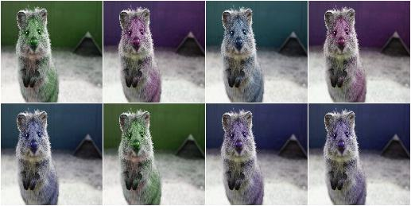

### Addtosaturation
*Sample random values from the discrete uniform range `[-50..50]`, and add them to the saturation, i.e. to the `S` channel in `HSV` colorspace:*

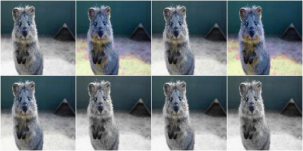


### Rotation
*Rotate each image’s red channel by 0 to 45 degrees:*

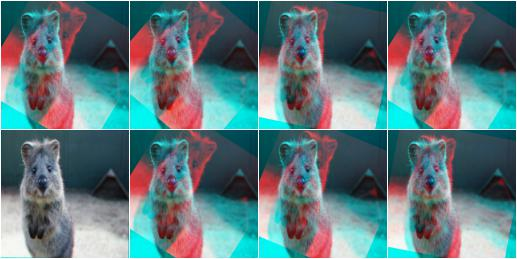


### Dropout 
*Create a dropout augmenter that drops on average half of all image channels. Dropped channels will be filled with zeros. At least one channel is kept unaltered in each image (default setting).*

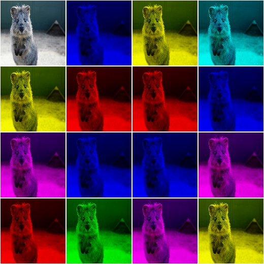


### Salt
*Replace 10% of all pixels with salt noise*

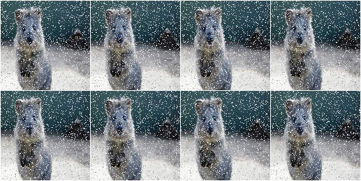


### Invert
*Invert in 50% of all images all pixels*

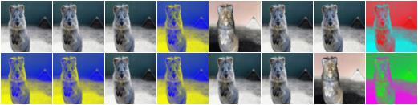

### HorizontalFlip
*Flip 50% of all images horizontally*

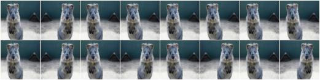
### Gaussian Noise
*Add noise each image with a gaussian kernel with a sigma of 3.0*

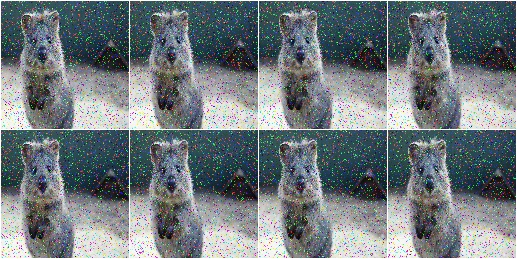


## Program Output
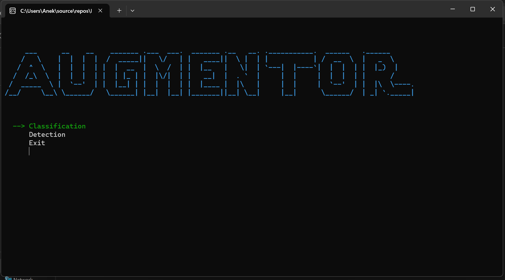
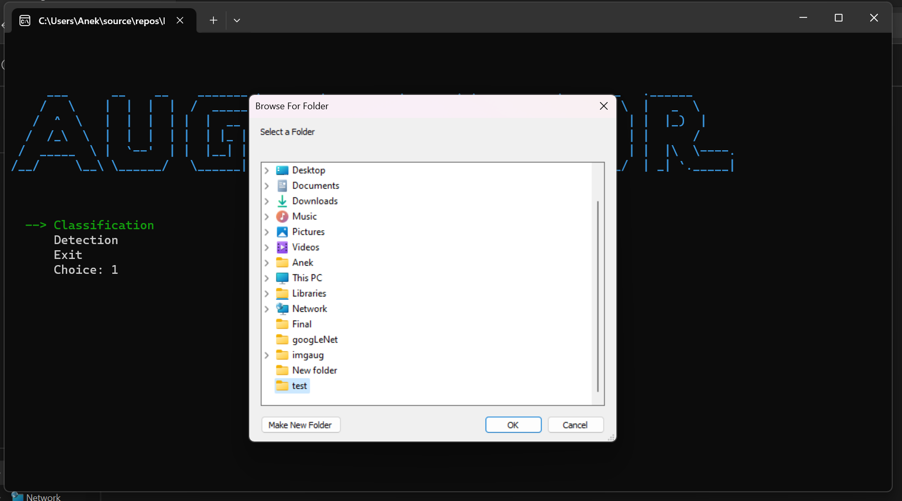
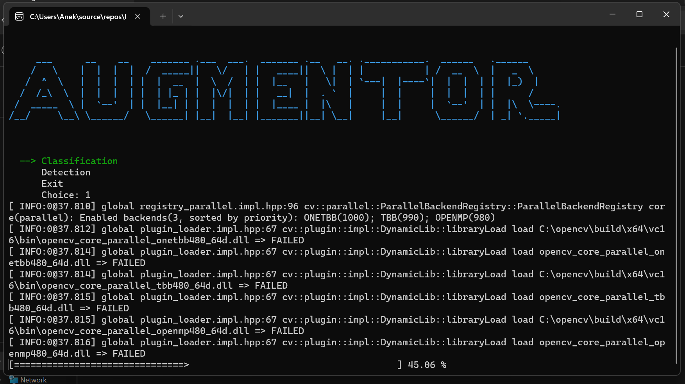

## Before and After
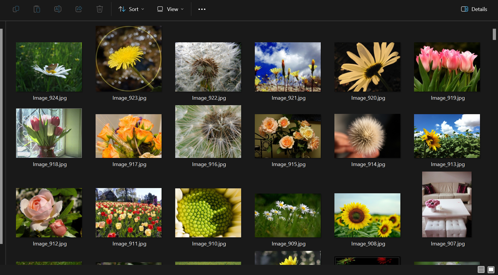
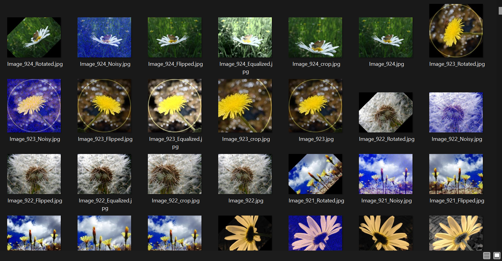
